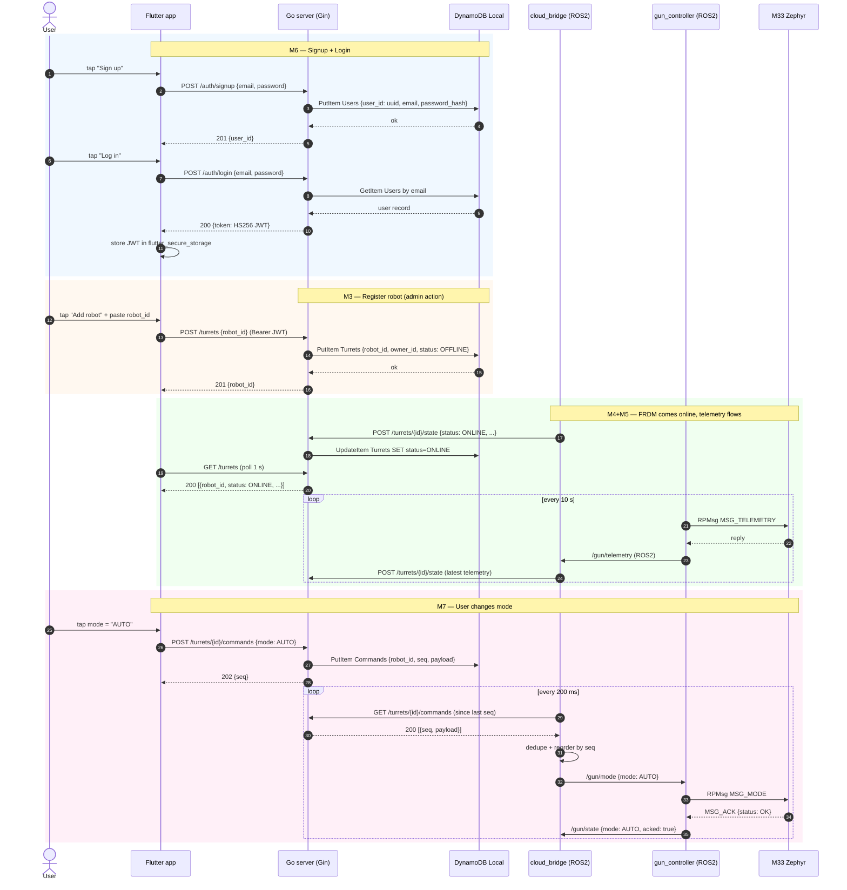

# INFRASTRUCTURE.md — MobTurret runtime topology

Visual map of where every process runs, what protocol each link uses,
and how the pieces fit together. Read this when you need to answer
"where does X live?" or "what port/protocol connects A and B?".

Diagrams use Mermaid syntax — renders natively on GitHub, in
VSCode (with the Mermaid extension), and in most Markdown viewers.

| | |
|---|---|
| Phase 1 | **In progress** — local dev, no AWS |
| Phase 2 | Planned — AWS services replace local stubs |

---

## 1. Phase 1 — Local development topology

This is what we have (or are building) right now. Every box is a
real running process on real hardware; every arrow is a real
network/protocol connection.

```mermaid
graph LR
    subgraph Laptop["Dev machine (laptop)"]
        direction TB
        Docker["Docker container<br/>amazon/dynamodb-local<br/>:8181"]
        Server["Go HTTP server<br/>Gin + Viper + Zap + Wire<br/>+ gin-contrib/cors + uuid<br/>:8080"]
        Mobile["Flutter app<br/>(Android emulator or device)"]
        SDK["Yocto SDK installer<br/>/opt/imx93-gunbot-sdk/<br/>(cross-compile toolchain)"]
    end

    subgraph FRDM["FRDM-iMX93 (the robot)"]
        direction TB
        subgraph A55["A55 core — Linux<br/>(Yocto image: imx93-gunbot)"]
            direction TB
            gc["gun_controller<br/>ROS2 Humble node (C++)<br/>subscribes /gun/target<br/>subscribes /gun/fire<br/>subscribes /gun/mode<br/>publishes /gun/state<br/>publishes /gun/telemetry"]
            cb["cloud_bridge<br/>ROS2 Humble node (C++)<br/>subscribes /gun/state<br/>subscribes /gun/telemetry<br/>HTTP POST state to server<br/>HTTP GET commands from server"]
        end
        subgraph M33["M33 core — Zephyr RTOS"]
            direction TB
            rpmsg["RPMsg endpoint<br/>(OpenAMP virtio,<br/>Linux kernel rpmsg_char driver)"]
            scscl["LPUART3 driver<br/>SCSCL protocol @ 1 Mbaud<br/>SC15 servos (ID 1, ID 2)"]
        end
    end

    subgraph External["External (not in this repo)"]
        direction TB
        Yocto["Yocto project<br/>~/Desktop/autonomous_explorer/<br/>imx93-frdm-yocto/frdm-imx93<br/>(MACHINE=imx93-frdm,<br/> DISTRO=imx93-gunbot)"]
        ZephyrSrc["Zephyr source<br/>github.com/nxp-zephyr/zephyr<br/>branch nxp-v4.3.0"]
    end

    Server -->|"DynamoDB API<br/>(localhost or docker network)"| Docker
    Mobile -->|"HTTPS REST<br/>(emulator: 10.0.2.2:8080<br/> device: LAN IP)"| Server

    cb -->|"HTTP POST /turrets/&#123;id&#125;/state<br/>HTTP GET  /turrets/&#123;id&#125;/commands<br/>(LAN, 200 ms poll)"| Server

    gc <-->|"RPMsg frames<br/>(see IPC.md)<br/>MSG_SET_TARGET, MSG_FIRE, MSG_MODE,<br/>MSG_TELEMETRY, MSG_ACK, MSG_ALERT"| rpmsg
    rpmsg --> scscl

    Yocto -.->|"produces A55 image<br/>+ cross-compile SDK"| A55
    Yocto -.->|"bitbake ... -c populate_sdk<br/>(not yet generated — see task #11)"| SDK
    ZephyrSrc -.->|"cloned into<br/>gun_bot/m33_firmware/nxp_zephyr/"| M33

    classDef ext fill:#fff5e6,stroke:#cc8800,color:#333
    class Yocto,ZephyrSrc ext
    classDef hw fill:#e6f2ff,stroke:#3366cc,color:#003366
    class Docker,Server,Mobile,SDK,A55,M33,gc,cb,rpmsg,scscl hw
```

### What runs where (table form)

| Process / service | Host | Port / device | Source in repo |
|---|---|---|---|
| DynamoDB Local | Laptop (Docker) | TCP 8181 | (image, no source) |
| Go HTTP server | Laptop | TCP 8080 | `server/cmd/server/` |
| Flutter app | Laptop (emulator) or phone | — | `gun_bot_mobile/` |
| Yocto SDK installer | Laptop | `/opt/imx93-gunbot-sdk/` | (extracted from `.sh`, no source) |
| `gun_controller` ROS2 node | FRDM A55 (systemd) | ROS2 DDS domain 0 | `gun_bot_controller/ros2_ws/src/gun_controller/` |
| `cloud_bridge` ROS2 node | FRDM A55 (systemd) | ROS2 DDS domain 0 | `gun_bot_controller/ros2_ws/src/cloud_bridge/` |
| Zephyr firmware | FRDM M33 (remoteproc) | — | `gun_bot/m33_firmware/gun_controller/` |
| RPMsg device | FRDM (kernel) | `/dev/rpmsg_ctrlN` + `/dev/rpmsgN` | (Linux kernel driver) |
| Servo bus | FRDM M33 LPUART3 | 1 Mbaud, half-duplex | (Zephyr driver) |
| Yocto build | Laptop (separate tree) | — | `~/Desktop/autonomous_explorer/imx93-frdm-yocto/` |

### Link legend

| Link | Protocol | When used |
|---|---|---|
| Laptop server ↔ DynamoDB Local | DynamoDB API (TCP 8181) | Every API call |
| Flutter app ↔ Laptop server | HTTPS REST (`/auth/*`, `/turrets/*`) | Every user action |
| `cloud_bridge` ↔ Laptop server | HTTPS REST (`/turrets/{id}/state`, `/turrets/{id}/commands`) | Every 200 ms (poll) + on state change |
| `gun_controller` ↔ M33 Zephyr | RPMsg over OpenAMP (kernel `rpmsg_char`) | Every servo command + telemetry tick |
| M33 ↔ SC15 servos | SCSCL over UART (1 Mbaud) | Every servo write/read |
| Laptop ↔ FRDM (deploy) | SSH + `scp` | Per code change |

---

## 2. Phase 2 — AWS production topology (preview, dashed)

What we're building toward. Dashed = not yet implemented; solid =
exists today.

```mermaid
graph LR
    subgraph Mobile["Flutter app"]
        direction TB
        App["Phase 1: HTTP to laptop server<br/>Phase 2: HTTPS to API Gateway +<br/>          WSS MQTT to IoT Core"]
    end

    subgraph FRDM2["FRDM-iMX93"]
        direction TB
        subgraph A552["A55 (Linux)"]
            direction TB
            gc2["gun_controller<br/>(unchanged)"]
            cb2["cloud_bridge<br/>(replaces HTTP polling<br/>with MQTT publish)"]
        end
        M33_2["M33 (Zephyr)<br/>(unchanged)"]
    end

    subgraph Cloud["AWS"]
        direction TB
        APIGW["API Gateway<br/>+ Cognito or custom-JWT authorizer"]
        LambdaAuth["Lambda: auth"]
        LambdaMedia["Lambda: presign_upload,<br/>media_list"]
        IoTCore["IoT Core<br/>(mTLS device certs)"]
        TelemetryIngest["Lambda: telemetry_ingest"]
        AlertRouter["Lambda: alert_router"]
        DDB["DynamoDB<br/>Users, Turrets,<br/>UsageLogs, SavedMedia"]
        S3["S3<br/>(alert video clips)"]
        SNS["SNS<br/>(push fan-out)"]
        FCM["FCM (Android)"]
        APNs["APNs (iOS)"]
    end

    App -->|REST| APIGW
    App -.->|push notifications| FCM
    App -.->|push notifications| APNs

    APIGW --> LambdaAuth
    APIGW --> LambdaMedia

    cb2 -.->|"MQTT/TLS over<br/>turret/&#123;id&#125;/telemetry<br/>(replaces HTTP polling)"| IoTCore
    cb2 -.->|"subscribes<br/>turret/&#123;id&#125;/cmd/+" | IoTCore

    IoTCore --> TelemetryIngest
    IoTCore --> AlertRouter

    TelemetryIngest --> DDB
    AlertRouter --> DDB
    AlertRouter --> S3
    AlertRouter --> SNS

    SNS --> FCM
    SNS --> APNs

    LambdaAuth --> DDB
    LambdaMedia --> DDB
    LambdaMedia --> S3

    classDef future fill:#f0f0f0,stroke:#999,stroke-dasharray: 5 5
    class APIGW,LambdaAuth,LambdaMedia,IoTCore,TelemetryIngest,AlertRouter,DDB,S3,SNS,FCM,APNs,cb2 future
```

The mobile app, FRDM-A55 ROS2 nodes, and M33 Zephyr firmware stay
the same — only `cloud_bridge`'s transport changes (HTTP → MQTT) and
the server moves from a laptop process to API Gateway + Lambda.

---

## 3. Happy-path sequence (Phase 1)

What happens when a user signs up, registers a robot, and changes
its mode end-to-end.

Round-trip for the mode change: ~200 ms (poll) + a few ms for
RPMsg + ACK. End-to-end latency is dominated by the poll interval;
Phase 3 replaces polling with a server-push WebSocket for sub-50 ms.

---

## 4. What to read next

- [`PLAN.md`](./PLAN.md) — phases & milestones (what we're building)
- [`design.md`](./design.md) — full architecture (what MobTurret is)
- [`IPC.md`](./IPC.md) — A55 ↔ M33 wire contract (how cores talk)
- [`server/CLAUDE.md`](./server/CLAUDE.md) — server-side details
- [`gun_bot_controller/CLAUDE.md`](./gun_bot_controller/CLAUDE.md) — FRDM-side details (incl. Yocto SDK)
- [`gun_bot/CLAUDE.md`](./gun_bot/CLAUDE.md) — M33 Zephyr firmware details
